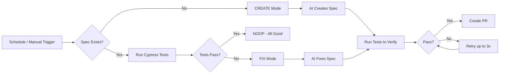

# 🧪 Self-Healing E2E — Keyboard Shortcuts

> Part of the AI-driven testing pipeline for [Rancher AI UI](../../README.md).

**Self-healing E2E test agent that creates, runs, and auto-fixes Cypress specs for keyboard shortcuts**

The [E2E Keyboard Shortcuts workflow](../.github/workflows/e2e-keyboard-shortcuts.md?plain=1) manages a persistent Cypress spec file. If the spec doesn't exist, the agent creates it. If it breaks due to UI changes, the agent fixes it — no human intervention needed.

## Installation

```bash
# Install the 'gh aw' extension
gh extension install github/gh-aw

# Add the workflow to your repository
gh aw add-wizard rancher-ai-ui/e2e-keyboard-shortcuts
```

This walks you through adding the workflow to your repository.

## How It Works



### Operating Modes

| Mode | Trigger | What Happens |
|------|---------|--------------|
| **CREATE** | Spec file missing or `force_recreate: true` | Agent writes a new spec from the test plan |
| **FIX** | Spec exists but Cypress tests fail | Agent reads error output, fixes broken parts |
| **NOOP** | Spec exists and all tests pass | Nothing to do — exits cleanly |

### What It Tests

The agent covers 7 keyboard shortcuts across 14 verification checkpoints:

1. **Open/Close Chat** — `Alt+K`
2. **New Chat** — `Ctrl+Shift+O`
3. **Toggle History** — `Ctrl+Shift+S`
4. **Copy Last Response** — `Ctrl+Shift+C`
5. **Delete Chat** — `Ctrl+Shift+Backspace`
6. **Prompt History** — `ArrowUp` / `ArrowDown` / `Tab`
7. **Shortcuts Popover** — via menu

## Usage

### Configuration

This workflow requires no configuration and works out of the box. It uses the project's existing Cypress setup, page objects, and LLM mock service.

After editing the workflow file, run `gh aw compile` to update the compiled workflow and commit all changes to the default branch.

### Commands

You can start a run of this workflow immediately by running:

```bash
gh aw run e2e-keyboard-shortcuts
```

To force a fresh spec creation (discarding the existing one):

```bash
gh aw run e2e-keyboard-shortcuts -- --force_recreate=true
```

### Triggering CI on Pull Requests

To automatically trigger CI checks on PRs created by this workflow, configure an additional repository secret `GH_AW_CI_TRIGGER_TOKEN`. See the [triggering CI documentation](https://github.github.com/gh-aw/reference/triggering-ci/) for setup instructions.

### Companion: E2E Verifier

The [E2E Verifier workflow](../.github/workflows/e2e-verifier.md?plain=1) runs automatically after the main workflow completes. It reviews screenshots from the test run and produces a structured QA report, catching visual regressions the Cypress assertions might miss.

## Shared Fragment

Both workflows import `shared/cypress-rancher-ai.md` which provides:
- Cypress page objects and their APIs
- Custom commands (`cy.login()`, `cy.enqueueLLMResponse()`, etc.)
- Known `data-testid` selectors
- Keyboard shortcut patterns
- Run configuration

## Learn More

- [E2E Keyboard Shortcuts source workflow](../.github/workflows/e2e-keyboard-shortcuts.md?plain=1)
- [E2E Verifier source workflow](../.github/workflows/e2e-verifier.md?plain=1)
- [Cypress Rancher AI shared fragment](../.github/workflows/shared/cypress-rancher-ai.md?plain=1)
- [GitHub Agentic Workflows documentation](https://github.github.com/gh-aw/)
